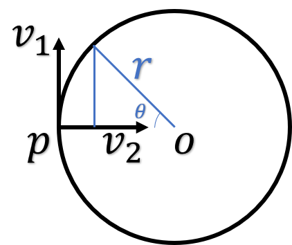

# DeepAnimation
CS2470 Fall 2021 final project.

## Circle sampler

Given a point 

on the circle, we can define a circle by specifying
,
which is the unit vector from 

to circle center
,
and 
,
which is the unit tangent vector that defines the sampling direction.
Then we sample angles from 
.
For a given
,
the corresponding point on the circle is defined as
 +
+
.

