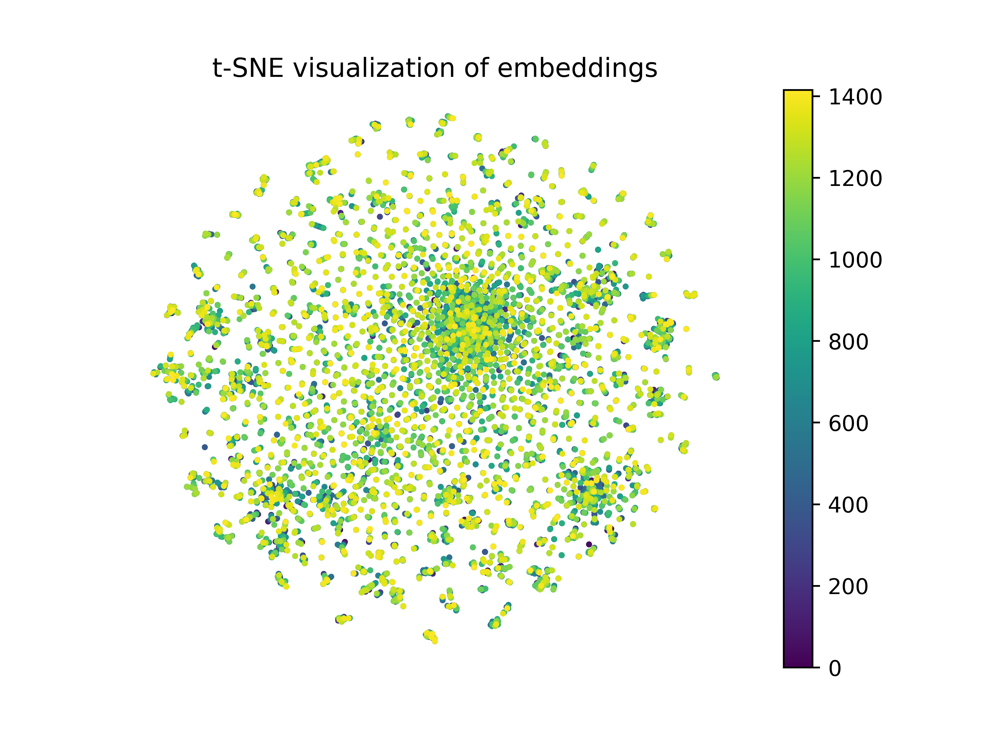

# DeepAnimation
CS2470 Fall 2021 final project.

## Download data and model weights

```bash
bash download.sh
bash download_weights.sh
```

## Circle sampler

Given a point 

on the circle, we can define a circle by specifying
,
which is the unit vector from 

to circle center
,
and 
,
which is the unit tangent vector that defines the sampling direction.
Then we sample angles from 
.
For a given
,
the corresponding point on the circle is defined as
 +
+
.


This is the visualization of samples surrounding an MNIST image.
We use VAE trained on MNIST to generate  this gif.


## Data from other domain

We tried this image with Chinese character on the VAE model trained 
on MNIST dataset.


The result is as follows, which means it doesn't generate well for 
different domains.


We also notice that the model tends to generate 3 and 6.
This is possibly because we are using the same sampling vectors
as the previous example.

## Environment Variable

On Linux:
```bash
export PYTHONPATH='${PYTHONPATH}:/path/to/DeepAnimation'
```
On Windows:
```bash
set PYTHONPATH=%PYTHONPATH%;\path\to\DeepAnimation\
```
On Colab:
```python
import os
os.environ['PYTHONPATH'] += ':/path/to/DeepAnimation'
```
## Results

### t-SNE visualization
Here we plot the t-SNE visualization of frames sampled fron all 1416 gifs,
each with 10 frames. 


### image query

We used the ahash algorithm as well as the latent vector to do deep hashing.
Therefore we can query hand drawings and fetch well-designed images
in our dataset.
With the hand drawing, the top-10 results are:


Note that the fifth result is a perfect match!

More results:


### play with your drawings

1. `cd` into `vaegan/experiments` 
2. Modify `query.py` `test_nearest_dataset()`. `frame_dir`
is image directory and `fmt` is image file name.
3. run `python query.py`
